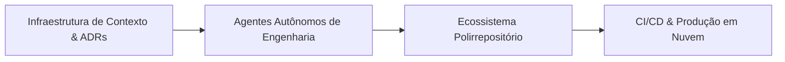

# Olá, eu sou o Yuri Fernandes 👋

> **Analista e Desenvolvedor de Sistemas • Arquiteto de Software & AI-Augmented Engineering**  
> Focado em transformar ideias em ecossistemas de produção robustos de ponta a ponta, combinando engenharia de software sólida, infraestrutura escalável em nuvem e orquestração avançada de agentes autônomos de IA.

---

## ⚡ Metodologia: AI-Augmented Engineering

Pratico a **Engenharia de Software Aumentada por IA (AI-Augmented Engineering)**: uma abordagem de alta velocidade que alia visão de produto, arquitetura de software sólida, cobertura de testes e orquestração de agentes autônomos como força multiplicadora de entrega.

### Como eu trabalho na prática:
* **Orquestração de Agentes Especializados:** Trabalho com fluidez utilizando **Antigravity**, **Codex**, **OpenCode** e **DeepSeek Harness**, tratando a IA como uma extensão técnica de alta precisão para prototipagem ágil, refatoração de código e arquitetura de sistemas.
* **Context Engineering (Engenharia de Contexto):** Agentes de IA só performam com excelência quando o contexto é cirúrgico. Projeto malhas de documentação estruturada que eliminam alucinações e alinham regras de negócio complexas.
* **Rigor com Testes e Tipagem:** A aceleração proporcionada pela IA é sempre respaldada por baterias automatizadas de testes unitários e de integração, garantindo que velocidade e estabilidade caminhem lado a lado.
* **Privacy & Compliance por Design:** Desenvolvimento orientado a normas rigorosas de privacidade (como a **LGPD**), assegurando proteção de dados sensíveis, consentimento explícito e mitigação de riscos regulatórios desde o primeiro dia de arquitetura.

---

## 📚 Infraestrutura de Contexto: O "Cérebro" dos Projetos

Para sustentar o desenvolvimento acelerado com múltiplos agentes autônomos sem perda de coerência técnica, projeto e mantenho uma **Infraestrutura de Contexto viva e indexada**:

* 🏛️ **Single Source of Truth (SSOT):** Base de conhecimento desacoplada do código executável, servindo como bússola para decisões arquiteturais e governança de agentes.
* 📜 **ADRs (Architecture Decision Records):** Registro formal e contínuo de decisões de engenharia, documentando o racional técnico, impacto de infraestrutura e critérios de escolha de cada solução.
* ⚖️ **Matriz de Precedência Documental:** Hierarquia clara de regras para guiar os agentes autônomos na resolução de conflitos técnicos de forma independente e consistente.
* 🧭 **Segregação Modular por Domínio:** Separação estrita de escopos (Produto, UX, Backend, Segurança/LGPD, Infraestrutura e Distribuição) para que o agente carregue exclusivamente o contexto relevante para cada tarefa.

---

## 📦 Arquitetura Polirrepositório & Ciclo de Vida Desacoplado

Adoto a divisão deliberada de sistemas complexos em um **ecossistema de repositórios modulares e especializados**, garantindo independência técnica, esteiras próprias de CI/CD e facilidade de manutenção:

* 📱 **Mobile Nativo:** Aplicações móveis focadas em performance fluida, arquitetura moderna reativa, persistência local criptografada e processamento *on-device*. Pipeline de **CI/CD na nuvem via GitHub Actions** para compilação, testes e assinatura automatizada de builds.
* ⚡ **Backend & Gateway Multicanal:** APIs assíncronas de alta concorrência com controle por semáforos, orquestração de mensageria em tempo real, validação segura de acessos e regras de negócio centrais.
* 🌐 **Web & PWA Especializado:** Aplicações web progressivas desenvolvidas sob princípios **Zero-Trust** (mínimo privilégio), defesas ativas contra acessos abusivos e paridade de experiência multiplataforma (iOS, Android e Desktop).
* 🛠️ **Operações & Serviços Desacoplados:** Painéis e utilitários internos que operam sob demanda consumindo serviços remotos, sem onerar a infraestrutura central de produção.

---

## ☁️ Infraestrutura, Nuvem & Portabilidade (Anti-Lock-in)

* **Produção Ativa na Nuvem:** Experiência prática na orquestração de ambientes em nuvem (**AWS**), instâncias dedicadas Linux (EC2), bancos de dados relacionais gerenciados (**PostgreSQL no RDS**), tráfego seguro de borda via **Cloudflare Tunnels** e governança Zero-Trust via **AWS Systems Manager (SSM)** (zero portas públicas de entrada).
* **Filosofia Anti-Vendor Lock-in:** Arquiteturas pensadas para independência de provedor. Código desacoplado de SDKs proprietárias, armazenamento agnóstico e playbooks de contingência prontos para migração rápida entre nuvens (AWS, GCP, VPS/Hostinger/Hetzner) conforme metas de custo e escala.
* **Processamento On-Device & IA Híbrida:**
  * Pipelines de processamento local com visão computacional/OCR no dispositivo, aplicando validações matemáticas de qualidade (como análise de nitidez de imagem pré-envio).
  * Síntese de voz neural (TTS) otimizada para streaming de áudio e baixa latência.
  * Experimentação e curadoria com modelos compactos (SLMs) para inferência local segura e custo de computação zero.

---

## 🛠️ Tecnologias & Ferramentas do meu dia a dia

### 🧠 Agentes & AI Engineering
* **Orquestração & Agentes:** Antigravity, Codex, OpenCode, DeepSeek Harness
* **IA & Áudio:** Hugging Face (Transformers, Datasets), Modelos Compactos (SLMs / LLMs), Piper Neural TTS, Google ML Kit (OCR on-device)

### 💻 Desenvolvimento & Mobile
* **Mobile Nativo:** Kotlin, Android SDK, Jetpack Compose, Material 3, Coroutines, Flow, Room DB, R8/ProGuard
* **Backend & APIs:** Python (FastAPI, Uvicorn, Asyncio, Pydantic), REST, WebSockets, Meta WhatsApp Cloud API
* **Web & Front-End:** Next.js, React, TypeScript, Tailwind CSS, PWAs

### ⚙️ Nuvem, DevOps & Segurança
* **Nuvem & Infraestrutura:** AWS (EC2, RDS, SSM), Firebase (Auth, Hosting)
* **Bancos de Dados:** PostgreSQL 18.3, SQLite / SQLCipher, Firestore
* **Redes & Segurança:** Cloudflare Tunnels, Reverse Proxies, Zero-Trust, LGPD Compliance
* **CI/CD & Containers:** GitHub Actions (Build e Assinatura de APKs), Docker & Compose, Linux (Ubuntu), Bash Scripting

---

## 💬 Filosofia de Trabalho

> *"Não me prendo a títulos formais — meu foco é resolver problemas reais, construir arquiteturas sólidas que não quebram e entregar valor seguro na mão de quem usa."*

* 🎯 **Pragmatismo:** Menos burocracia e mais código funcional, coberto por testes e rodando em produção.
* 🔒 **Privacidade & Segurança:** Compliance com a LGPD e defesa em profundidade desenhados desde o primeiro dia.
* ⚡ **Velocidade com Qualidade:** O uso estruturado de agentes de IA acelera o desenvolvimento sem nunca sacrificar a excelência técnica.

---

## 📬 Conecte-se comigo

